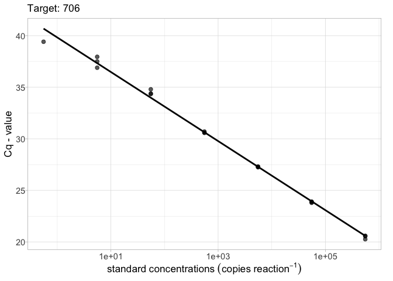
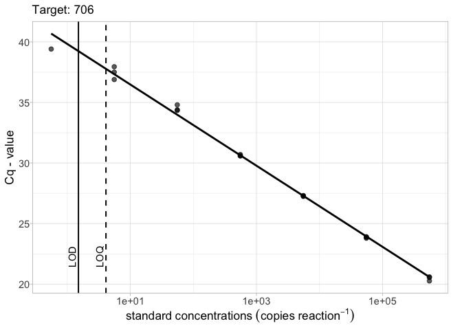
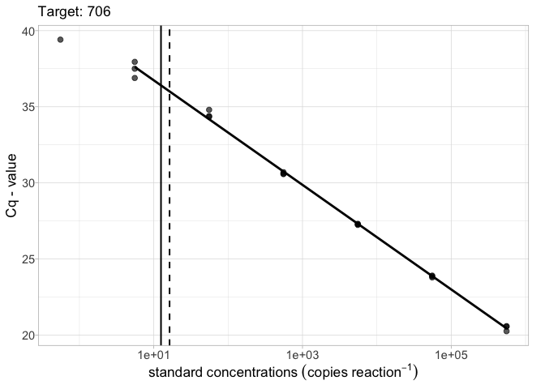

<!-- README.md is generated from README.Rmd. Please edit that file -->

# ednar

<!-- badges: start -->

[](https://www.tidyverse.org/lifecycle/#experimental)
[](https://CRAN.R-project.org/package=ednar)
<!-- badges: end -->

The goal of ednar is to provide a suite of easy to use functions to help
with qPCR based targeted eDNA data analysis.

## Installation

You can install the development version from
[GitHub](https://github.com/) with:

``` r
# install.packages("remotes")
remotes::install_github("alexd106/ednar")
```

## Example usage

### Plotting standard curves

To plot a basic qPCR standard curve for a specified target:

``` r
library(ednar)
calib_plot(calib_data, target = "706")
```



To include the the limit of detection (LOD) and optionally the limit of
quantification (LOQ) (usually obtained using the `calib_lod()` function)
on the plot use the `lod =` argument. LODs and LOQs can be supplied as
either a `data.frame` object or as a vector.

``` r
# LOD as a vector
lod_vec <- 1.5
calib_plot(calib_data, target = "706", lod = lod_vec)
```


``` r
# LOD and LOQ as a vector
lod_vec <- c(1.5, 4.1)
calib_plot(calib_data, target = "706", lod = lod_vec)
```



``` r
# LOD and LOQ as a tibble
library(tibble)
lod_data <- tibble(Target = "706", lod = 1.5, loq = 4.3)
calib_plot(calib_data, target = "706", lod = lod_data)
```


The `robust = TRUE` argument will exclude standards with less than 50%
detections when fitting the linear model

``` r
# LOD and LOQ as a tibble and robust = TRUE
library(tibble)
lod_data <- tibble(Target = "706", lod = 12.5, loq = 16.3)
calib_plot(calib_data, target = "706", lod = lod_data, robust = TRUE)
```



### Summary statistics from standard curve data

To generate a table of summary statistics (slope and intercept
estimates, test statistics etc) using standard curve data for each
‘Target’ we can use the `calib_stats()` function with the argument
`type = "effects"`.

``` r
sum_stats <- calib_stats(calib_data, type = "effects")
sum_stats
# # A tibble: 6 x 6
#   Target   term        estimate std.error statistic  p.value
#   <fct>    <chr>          <dbl>     <dbl>     <dbl>    <dbl>
# 1 90720202 (Intercept)    39.9     0.357      112.  4.54e-22
# 2 90720202 log10(SQ)      -3.40    0.119      -28.5 8.57e-14
# 3 10720201 (Intercept)    39.7     0.234      169.  1.19e-21
# 4 10720201 log10(SQ)      -3.38    0.0734     -46.0 7.27e-15
# 5 706      (Intercept)    39.8     0.197      202.  3.53e-30
# 6 706      log10(SQ)      -3.35    0.0552     -60.6 2.62e-21
```

To obtain the *R^2* estimates use `type = "r2"`

``` r
sum_stats <- calib_stats(calib_data, type = "r2")
sum_stats
# # A tibble: 3 x 2
#   Target   r.squared
#   <fct>        <dbl>
# 1 90720202     0.983
# 2 10720201     0.994
# 3 706          0.995
```

### Estimate LOD and LOQ from standard curve data

To obtain model based estimates of LOD and LOQ from the standard curve
data from each ‘Target’ we can use the `calib_lod()` function. The
`calib_lod()` function can automatically determine the ‘best’ model for
LOQ by fitting linear, exponential decay, and up to 6^th order
polynomial models and selecting the model with the lowest residual
standard error. LOD estimates are obtained by fitting a series of dose
response models using the `drc` package (see the
`drc::getMeanFunctions()` function to see all possible models) and
selecting the ‘best’ model based on log likelihood values, Akaike’s
information criterion and residual variance.

``` r
qpcr_lod <- calib_lod(data = calib_data, threshold = 0.35,
              lod.fit = "best", loq.fit = "best")
# [1] "WARNING: For 90720202, only 1 standard detected in the informative range (not 0% and not 100%).  Therefore, the LoD model results will be less reliable."
# Weibull (type 2) 
# (4 parameters) 
# In 'drc':  W2.4 
# 
# [1] "WARNING: For 10720201, only 1 standard detected in the informative range (not 0% and not 100%).  Therefore, the LoD model results will be less reliable."
# Weibull (type 2) 
# (4 parameters) 
# In 'drc':  W2.4 
# 
# [1] "WARNING: For 706, only 1 standard detected in the informative range (not 0% and not 100%).  Therefore, the LoD model results will be less reliable."
# Weibull (type 2) 
# (4 parameters) 
# In 'drc':  W2.4
```

To display a summary of the LOD and LOQ estimates for each ‘Target’

``` r
qpcr_lod$assaySum
#      Assay R.squared     Slope Intercept Low.95      LOD       LOQ rep2.LOD
# 1 90720202 0.9830248 -3.398584  39.93326  5.548 2.180560 11.000000 1.358718
# 2 10720201 0.9943614 -3.378033  39.69622 55.480 9.014319  9.014319 6.449130
# 3      706 0.9953952 -3.349245  39.82581  5.548 2.994413  8.000000 1.670059
#   rep3.LOD  rep4.LOD  rep5.LOD  rep8.LOD Efficiency LOD.model
# 1 1.029598 0.8456490 0.7259391 0.5264376  0.9689750      W2.4
# 2 5.301822 4.6140218 4.1427325 3.3020967  0.9771073      W2.4
# 3 1.186418 0.9308752 0.7712566 0.5190739  0.9887252      W2.4
```

To display a summary for each of the standards and Targets

``` r
qpcr_lod$standardsSum
#    Standards   Target Reps Detects  Cq.mean      Cq.sd    Copy.CV      Cq.CV
# 1  5.548e+04 90720202    3       3 23.72667 0.09226231 0.06205315 0.06401680
# 2  5.548e+03 90720202    3       3 27.21967 0.07522189 0.05167608 0.05217530
# 3  5.548e+02 90720202    3       3 30.54967 0.10108083 0.06977608 0.07014996
# 4  5.548e+01 90720202    3       3 33.97567 0.09859175 0.06801555 0.06841846
# 5  5.548e+00 90720202    3       3 38.00800 1.53209269 0.80975638 1.44525589
# 6  5.548e-01 90720202    3       1 39.47000         NA         NA         NA
# 7  5.548e-02 90720202    3       0      NaN         NA         NA         NA
# 8  5.548e+04 10720201    3       3 23.69967 0.01778576 0.01210139 0.01232862
# 9  5.548e+03 10720201    3       3 26.88167 0.18800621 0.13224413 0.13087120
# 10 5.548e+02 10720201    3       3 30.55533 0.13154594 0.09127219 0.09137054
# 11 5.548e+01 10720201    3       3 33.92967 0.11374240 0.07572288 0.07896290
# 12 5.548e+00 10720201    3       2 37.00750 1.13490638 0.70467061 0.92560975
# 13 5.548e-01 10720201    3       0      NaN         NA         NA         NA
# 14 5.548e-02 10720201    3       0      NaN         NA         NA         NA
# 15 5.548e+05      706    3       3 20.47000 0.18248288 0.12950912 0.12699510
# 16 5.548e+04      706    3       3 23.85667 0.06110101 0.04227123 0.04237099
# 17 5.548e+03      706    3       3 27.27667 0.03511885 0.02418331 0.02434614
# 18 5.548e+02      706    3       3 30.62667 0.06429101 0.04368325 0.04458526
# 19 5.548e+01      706    3       3 34.51000 0.25238859 0.16446173 0.17628953
# 20 5.548e+00      706    3       3 37.44667 0.53200877 0.36901392 0.38165929
# 21 5.548e-01      706    3       1 39.41000         NA         NA         NA
#         Rate
# 1  1.0000000
# 2  1.0000000
# 3  1.0000000
# 4  1.0000000
# 5  1.0000000
# 6  0.3333333
# 7  0.0000000
# 8  1.0000000
# 9  1.0000000
# 10 1.0000000
# 11 1.0000000
# 12 0.6666667
# 13 0.0000000
# 14 0.0000000
# 15 1.0000000
# 16 1.0000000
# 17 1.0000000
# 18 1.0000000
# 19 1.0000000
# 20 1.0000000
# 21 0.3333333
```

With the `calib_lod()` function you can also fit specific models for
both LOD and LOQ estimation. For example to estimate LOQ using an
exponential decay model and LOD with a 4 parameter Weibull type II
model.

``` r
qpcr_lod <- calib_lod(data = calib_data, threshold = 0.35,
              lod.fit = "W2.4", loq.fit = "decay")
# Weibull (type 2) 
# (4 parameters) 
# In 'drc':  W2.4 
# 
# [1] "WARNING: For 90720202, only 1 standard detected in the informative range (not 0% and not 100%).  Therefore, the LoD model results will be less reliable."
# [1] "WARNING: For 10720201, only 1 standard detected in the informative range (not 0% and not 100%).  Therefore, the LoD model results will be less reliable."
# [1] "WARNING: For 706, only 1 standard detected in the informative range (not 0% and not 100%).  Therefore, the LoD model results will be less reliable."
```
